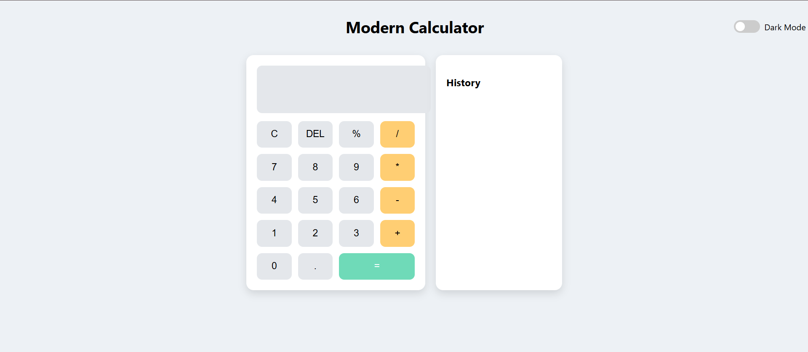

# Modern Calculator App

A clean, responsive, and user-friendly **Calculator Application** built using **HTML, CSS, and JavaScript**.  
Designed with a **modern UI**, **Dark/Light Theme Toggle**, **History Panel**, and **Keyboard Support** — optimized for desktop and mobile usage.

---

## 🌐 Live Demo

https://21a91a05d0.github.io/Modern-Calculator-App/

---

## 🖼️ Screenshot



## ✨ Features

| Feature | Description |
|--------|-------------|
| ✅ Basic Calculator | +, −, ×, ÷, %, decimals supported |
| 🌗 Dark / Light Mode | Theme toggle with saved preference |
| 🧾 History Panel | View and reuse past calculations |
| ⌨️ Keyboard Support | Type directly using your keyboard |
| 📱 Fully Responsive | Works smoothly on mobile & desktop |
| 🎨 Modern UI Design | Calm color palette and rounded components |

---

## 🛠️ Tech Stack

| Technology | Use |
|-----------|-----|
| **HTML5** | Structure & Layout |
| **CSS3**  | Styling and UI design |
| **JavaScript (ES6)** | Logic and Interactivity |

---

## 📂 Folder Structure

Modern-Calculator-App/
│
├── index.html
├── style.css
└── script.js


> *(If you are using the single-file compiled version, you will only have `index.html`.)*

---

## 🚀 Getting Started

### 1) Clone the Repository
```bash
git clone https://github.com/21A91A05D0/Modern-Calculator-App.git
cd Modern-Calculator-App

2) Run the App

Open index.html in your browser
OR (recommended) use Live Server Extension in VS Code.

🤝 Contributing

Contributions are welcome!
Feel free to Fork, create a branch, commit your changes, and submit a Pull Request.

⭐ Show Support

If you liked this project, please Star ⭐ the repository — it helps others find it!

📜 License

This project is released under the MIT License.
You are free to use, modify, and distribute it.
